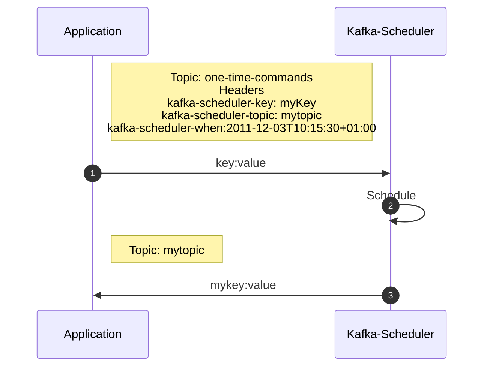
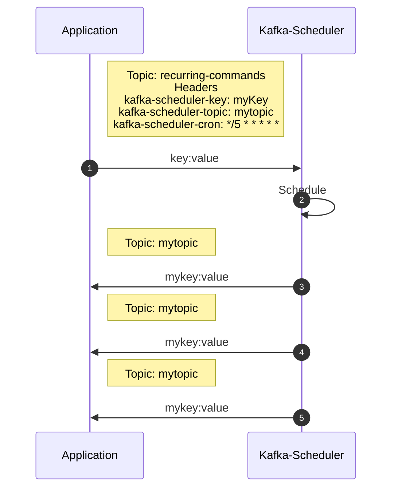
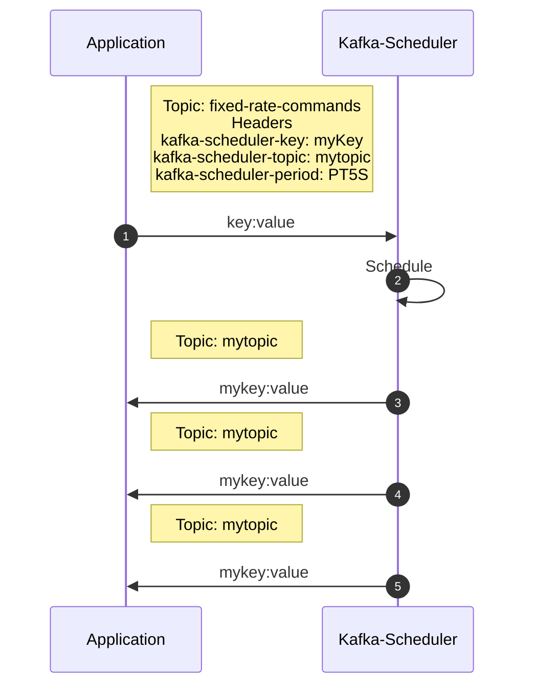

# kafka-scheduler

A scalable, distributed kafka message scheduler with only a Kafka cluster as a dependency.

## Why?

Some applications or microservices run without any database or external dependency
only sending and receiving messages through Kafka.

If they have to schedule some tasks for example

* Send out a reminder email every day if a user has not verified their email
* Generate an export every 30 minutes
* ...

the application has to make sure that the task is executed exactly once.
Even if the application moves to another node on a Kubernetes cluster.

The usual way to handle persistent jobs would be to use Quartz, Hangfire or Jobrunr.
But all of them depend on a database.

Why should I have to introduce a database into my stack if I can "just" stay with Kafka?

## How?

kafka-scheduler lets you schedule kafka message with a desired key, value and headers and
when you want to receive them on which topic. This way your application receives the message
as a trigger and can execute the business logic on the desired schedule.

### OneTimeCommand

A fire and forget command which will be triggered at a certain point in the future.

#### Headers

|        Header         |                           Description                            |
|:---------------------:|:----------------------------------------------------------------:|
|  kafka-scheduler-key  | The kafka message key used as a unique id so it can be cancelled |
| kafka-scheduler-value |         The Kafka message value you want to receive back         |
| kafka-scheduler-when  |                 A ISO-6801 configured Timestamp                  |

#### Key and Value

| Field |                           Description                            |
|-------|:----------------------------------------------------------------:|
| Key   | The kafka message key used as a unique id so it can be cancelled |
| Value |         The Kafka message value you want to receive back         |

### RecurringCommand

A command which will be triggered on a CRON schedule

#### Headers

|        Header         |                           Description                            |
|:---------------------:|:----------------------------------------------------------------:|
|  kafka-scheduler-key  | The kafka message key used as a unique id so it can be cancelled |
| kafka-scheduler-value |         The Kafka message value you want to receive back         |
| kafka-scheduler-cron  |        A cron expression with [extended syntax support]()        |

#### Key and Value

| Field |                           Description                            |
|-------|:----------------------------------------------------------------:|
| Key   | The kafka message key used as a unique id so it can be cancelled |
| Value |         The Kafka message value you want to receive back         |

### FixedRateCommand

A command which a defined duration between runs

#### Headers

|         Header         |                           Description                            |
|:----------------------:|:----------------------------------------------------------------:|
|  kafka-scheduler-key   | The kafka message key used as a unique id so it can be cancelled |
| kafka-scheduler-value  |         The Kafka message value you want to receive back         |
| kafka-scheduler-period |                       A ISO-8601 Duration                        |

#### Key and Value

| Field |                           Description                            |
|-------|:----------------------------------------------------------------:|
| Key   | The kafka message key used as a unique id so it can be cancelled |
| Value |         The Kafka message value you want to receive back         |

### Cancelling Commands

TBD

## Client SDK

TBD

## Detailed Documentation

TBD
